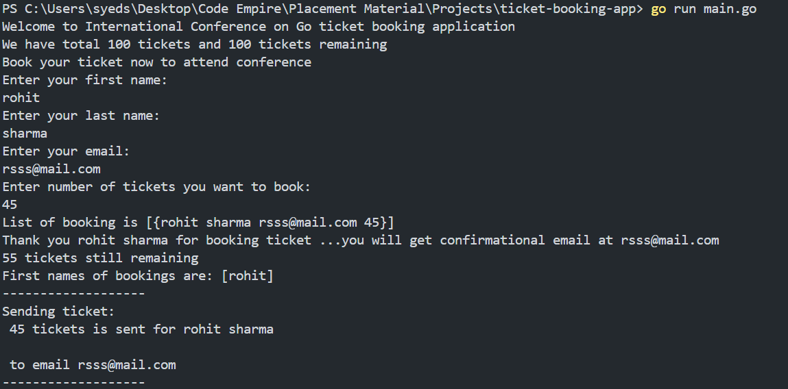

# 🎟️ Go Ticket Booking Application

A simple command-line based **ticket booking system** built in **Go (Golang)**.  
This project demonstrates the use of Go fundamentals like **goroutines**, **wait groups**, **structs**, **slices**, and **basic input validation**.

---

## 📘 Overview

This application simulates booking tickets for a conference — the  
**"International Conference on Go"**.

Users can:
- Enter their name, email, and number of tickets to book.
- View remaining tickets after each booking.
- Receive simulated confirmation messages asynchronously (using goroutines).

---

## ⚙️ Features

✅ Real-time ticket tracking  
✅ Input validation (name, email, ticket count)  
✅ Concurrency via goroutines (`sendTickets` runs in background)  
✅ Uses structs and slices for storing user data  
✅ Simple, beginner-friendly Go syntax and logic  

---

## 🧩 Tech Stack

- **Language:** Go (Golang)
- **Concepts Used:** Goroutines, WaitGroups, Structs, Slices, Validation

---

## 🧠 Code Flow

1. Greet the user and show available tickets.  
2. Collect user input — name, email, number of tickets.  
3. Validate user input (minimum name length, valid email, available tickets).  
4. Book tickets and update the remaining count.  
5. Use a **goroutine** to simulate sending tickets asynchronously.  
6. Display booked users’ first names.

---

## 🖥️ Sample Output

Below is a sample console output from running the program:



---

## ▶️ How to Run

### 1️⃣ Clone the Repository
```bash
git clone https://github.com/<your-username>/go-ticket-booking-app.git
cd go-ticket-booking-app
```

### 2️⃣ Run the Program
```bash
go run main.go
```

### 3️⃣ Example Run
```
Welcome to International Conference on Go ticket booking application
We have total 100 tickets and 100 tickets remaining
Book your ticket now to attend conference
Enter your first name:
rohit
Enter your last name:
sharma
Enter your email:
rsss@mail.com
Enter number of tickets you want to book:
45
```

---

## 🕓 Future Improvements

- Add persistent storage (saving bookings to a file or database)
- Web-based version with a simple frontend
- Email integration using SMTP

---

## 👨‍💻 Author

Developed by **Sayan** — as part of placement preparation and Go learning projects.  
> A simple yet effective project to demonstrate Go concurrency and CLI-based development.
